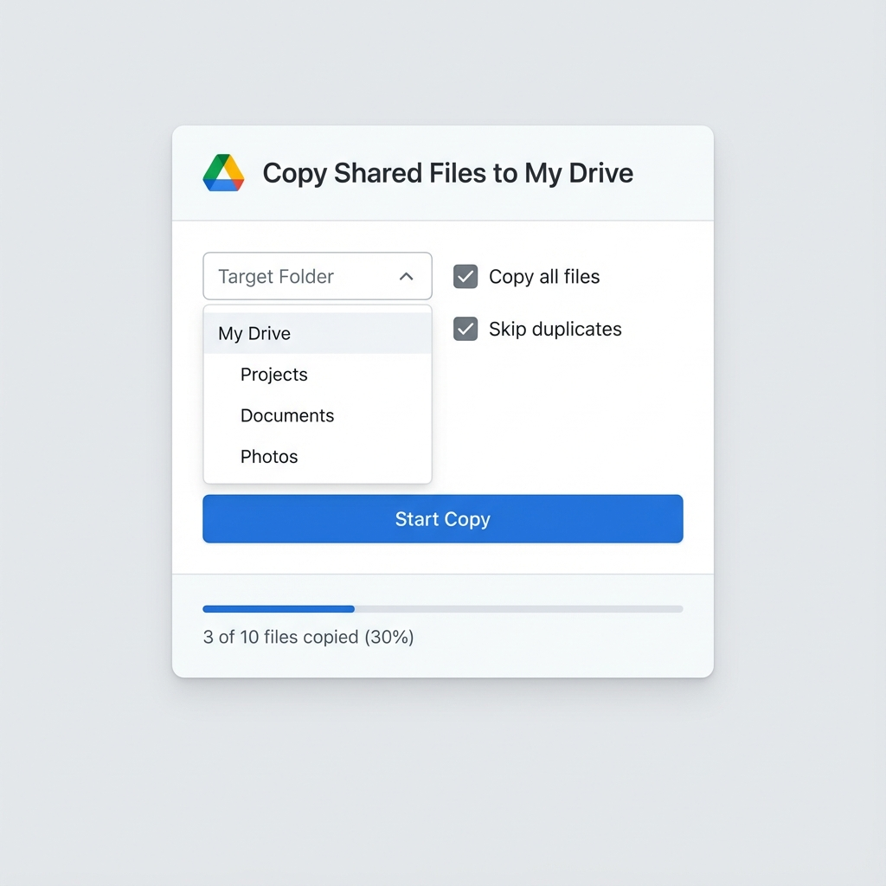

# 📁 Google Drive Copy Tool

[](https://opensource.org/licenses/MIT)
[](https://script.google.com)
[](CONTRIBUTING.md)
[](https://queery.my.id/)

> Copy files from "Shared with me" to your Google Drive — a feature Google doesn't provide natively!



## ✨ Features

- 📂 **Select target folder** — Choose any folder in My Drive
- 🔍 **Filter by file type** — Documents, Spreadsheets, PDFs, Images
- 🔃 **Sort files** — By date, name, size, or owner
- ⏭️ **Skip duplicates** — Avoid copying files that already exist
- ✅ **Multi-select** — Choose specific files or select all
- 📊 **Progress tracking** — Real-time progress bar with results summary
- 🎨 **Modern UI** — Beautiful gradient design, mobile-responsive
- 🔒 **Privacy-first** — Runs as YOUR account, accesses YOUR Drive only
- 💰 **Free hosting** — Hosted on Google's infrastructure at no cost

## 🚀 Quick Start

### Option 1: Deploy Your Own (Recommended)

**Step 1:** Go to [Google Apps Script](https://script.google.com) and create a new project

**Step 2:** Enable manifest file:
- Click ⚙️ **Project Settings**
- Check ✅ **Show "appsscript.json" manifest file in editor**

**Step 3:** Add the files:
- Replace `Code.gs` content with [`Code.gs`](Code.gs)
- Create HTML file `Index` and paste [`Index.html`](Index.html)
- Replace `appsscript.json` with [`appsscript.json`](appsscript.json)

**Step 4:** Deploy:
- Click **Deploy** → **New deployment**
- Select type: **Web app**
- Execute as: **User accessing the web app**
- Who has access: **Anyone**
- Click **Deploy** → **Authorize access**

**Step 5:** Open the provided URL and start copying! 🎉

## 📸 Screenshots

### Main Interface
Clean, modern UI with file selection, sorting, and progress tracking.

### Features
- Sort by: Date (Newest/Oldest), Name (A-Z), Size, Owner
- Filter by file type
- Skip duplicates option
- Results summary with success/skip/fail counts

## 🔐 Permissions

The app requires these Google permissions:

| Permission | Why Needed |
|------------|------------|
| See all your Google Drive files | To list shared files |
| Edit your Google Drive files | To create file copies |
| View your email address | To display logged-in user |

**Note:** The app runs as YOUR user, so it only accesses YOUR Drive.

## ⚠️ Limitations

| Aspect | Limit |
|--------|-------|
| Execution time | 6 minutes per run |
| Files per run | 500 files max (to prevent timeout) |
| Google Workspace files | Creates editable copies |

For very large libraries, run multiple times or filter by file type.

## 🛠️ Development

### Prerequisites
- Google account
- Access to [Google Apps Script](https://script.google.com)

### Project Structure
```
gdrive-copy-tool/
├── Code.gs           # Backend logic
├── Index.html        # Frontend UI
├── appsscript.json   # App manifest with scopes
├── README.md         # This file
├── LICENSE           # MIT License
├── CONTRIBUTING.md   # Contribution guidelines
├── CHANGELOG.md      # Version history
└── screenshot.png    # UI preview
```

## 🤝 Contributing

Contributions are welcome! See [CONTRIBUTING.md](CONTRIBUTING.md) for guidelines.

## 📝 License

This project is licensed under the MIT License - see the [LICENSE](LICENSE) file for details.

## 👨‍💻 Author

**queery-id**
- Website: [https://queery.my.id/](https://queery.my.id/)
- GitHub: [@queery-id](https://github.com/queery-id)

---

**⭐ If this tool helped you, please give it a star!**
